# M3C
Module 3 Challenge: GW Coding Bootcamp

## Description
This site was built for my third week homework challenge for GW's coding bootcamp. The goal of this weeks assignment was to create the javascript necessary for a password generator that asks you for perameters of the given password and then placing them within the HTML of the website using DOM manipulation. 

## Installation
N/A

## Usage
To use this site appropriatly, Open the website and then click on the "Generate Password" button and then answer the requests for the password perameters. After answering, the website will display your password in the box above the button.
The following screenshots display each of the page states and a completed expample of the password generation.
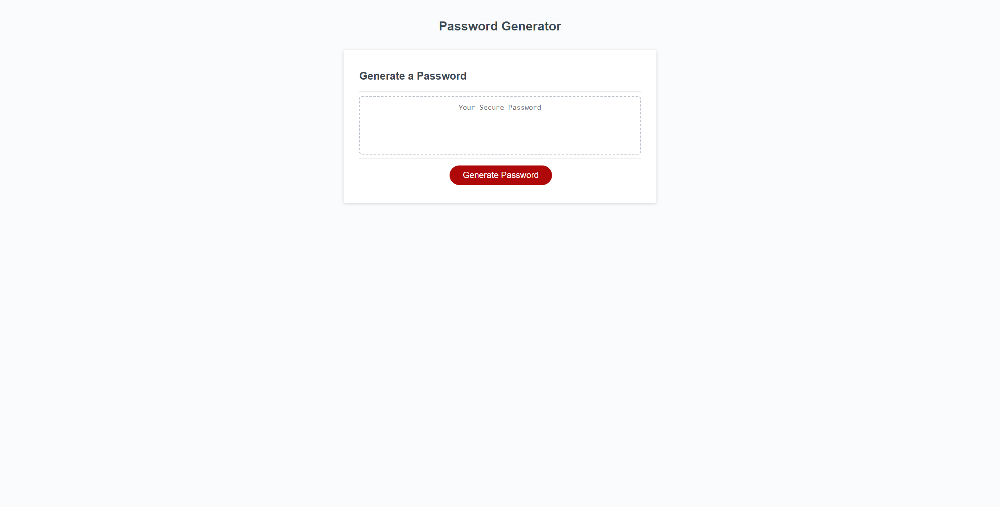
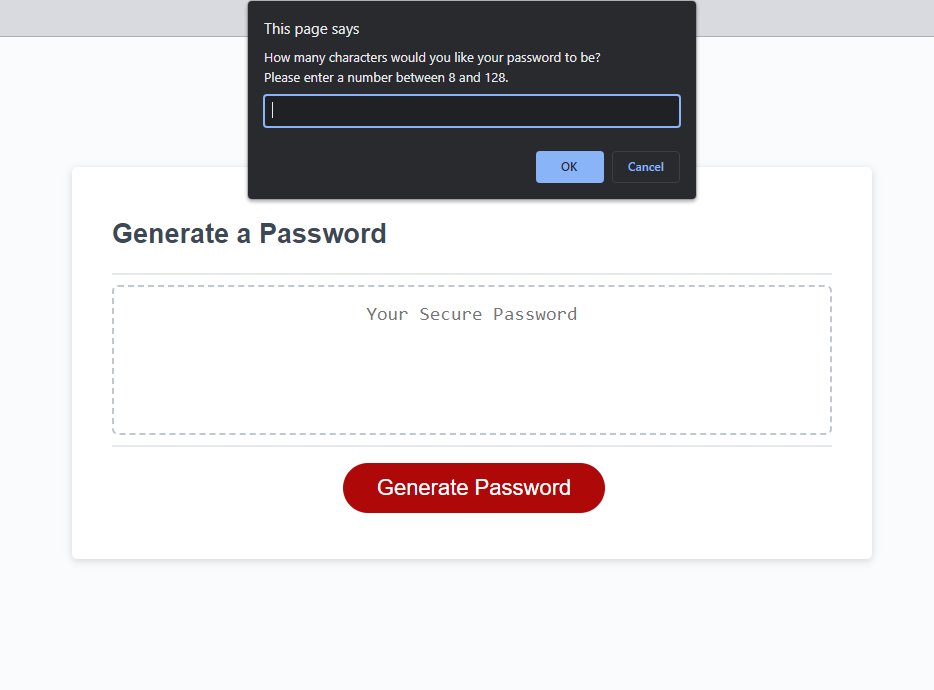
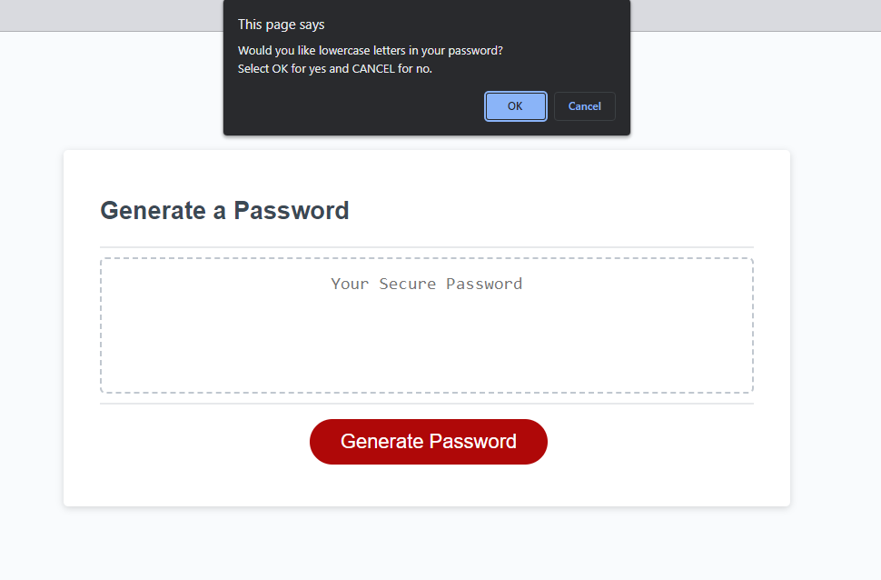
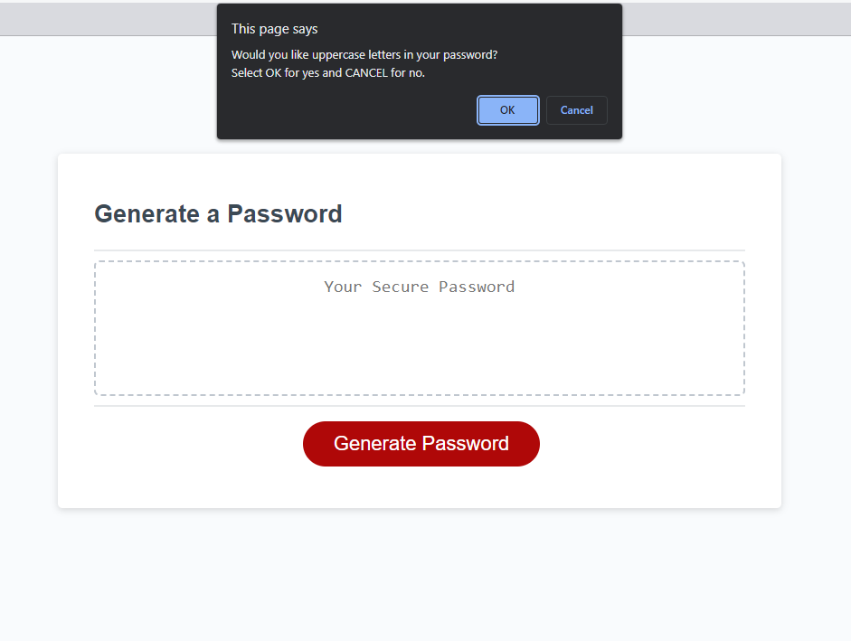
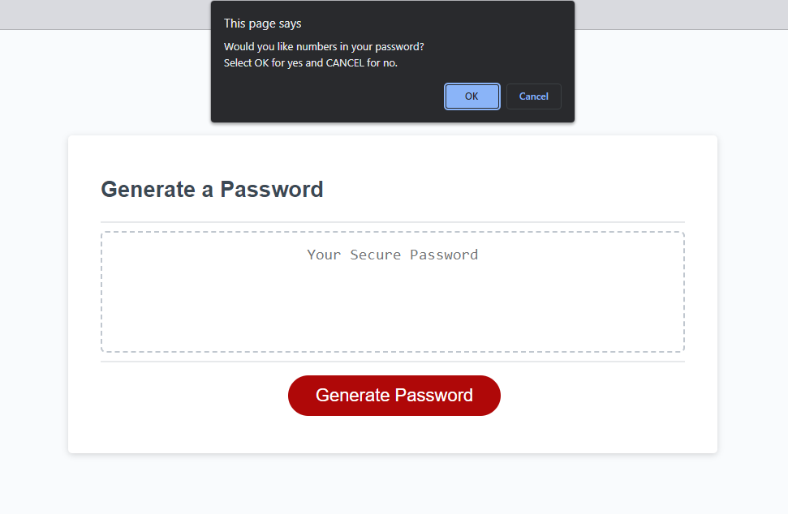
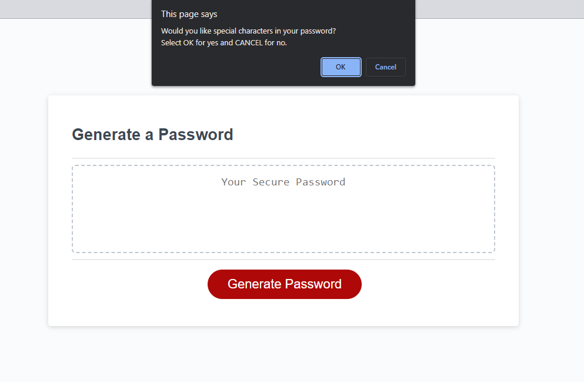
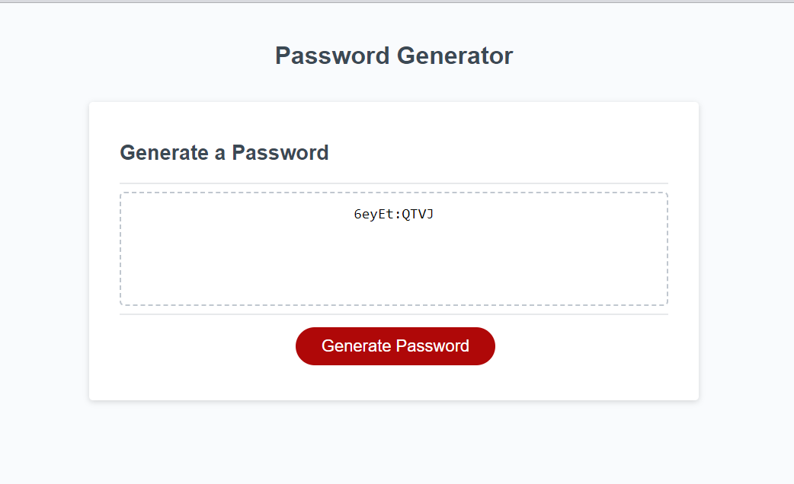

## Credits
Brian McDonell (https://github.com/bpmcdonell)
GW Coding Bootcamp

## Licence
N/A

## Features
This site features the use of javascript logic, error validaiton, functions, for loops, objects, event listeners, and DOM manipulation. 

## Tests
This site features tests for some failiure states that can occur when attempting to generate a password, such as; selecting a length for the password that is too short (password < 8 or password > 128) and not selecting any of the character types for the password. Those failure states and the subsequent alerts to retry are shown in the screenshots below. 
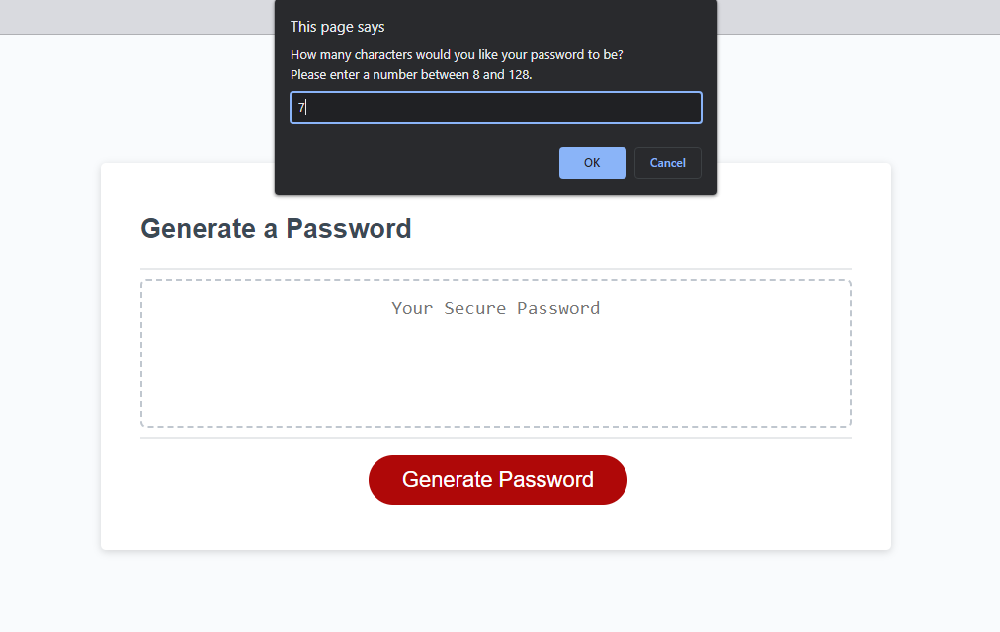
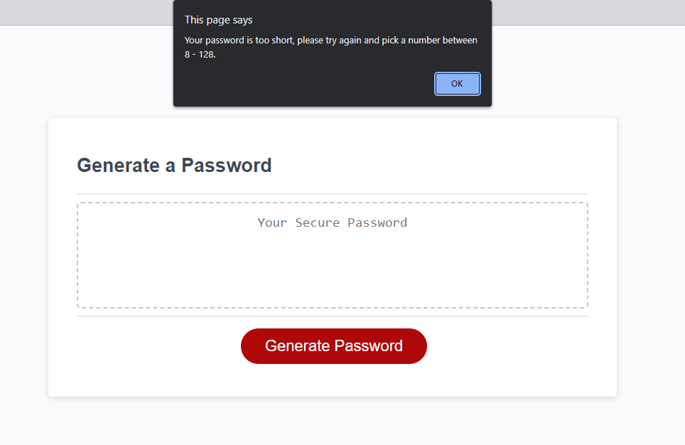
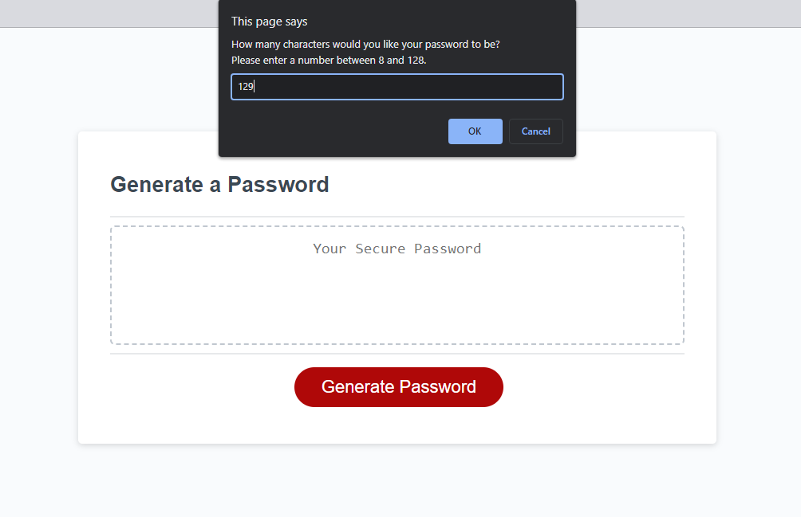
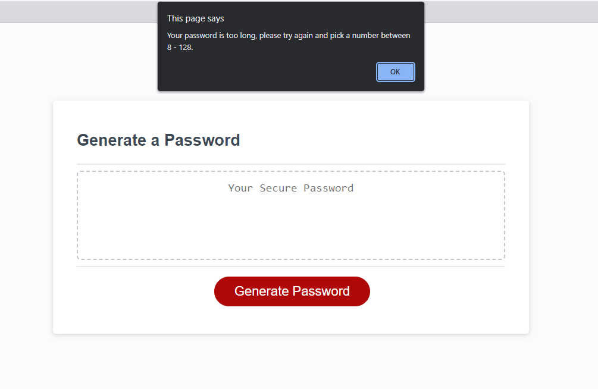
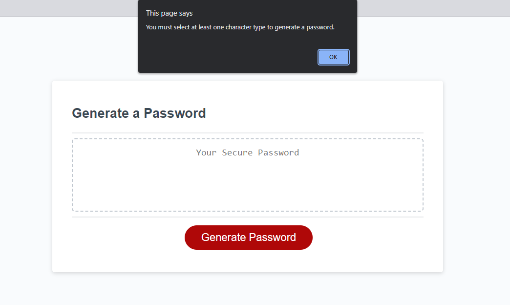
